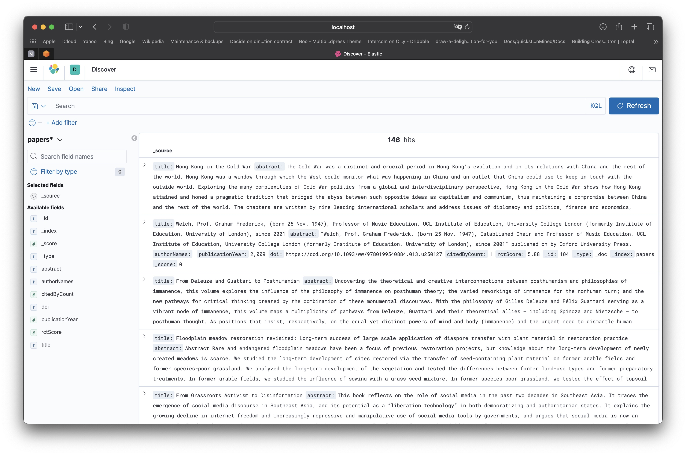

# Ought Demo Search Engine

## Running the demo locally

Run `build.sh` to spin up the containers using `docker-compose.yml`.

```
./build.sh
```

| URL                     | Service       |
|-------------------------|---------------|
| `http://localhost:9200` | Elasticsearch |
| `http://localhost:5601` | Kibana        |
| `http://localhost:5000` | Flask         |

Within other containers, Elasticsearch is accessed at `http://elasticsearch:9200`.

## API

`http://localhost:5000/` = Renders the main search HTML page.

`http://localhost:5000/search` = For making client-side requests to query the search engine.

`http://localhost:5000/process-data` = Preprocesses and ingests data from the provided datasets.

`http://localhost:5000/similarity-score` Calculates a similarity score between two documents.


## Overview

```
├── README.md
├── build.sh
├── docker-compose.yml
├── venv
│   ├── bin
│   ├── etc
│   ├── include
│   ├── lib
│   ├── pyvenv.cfg
│   └── share
└── web
    ├── Dockerfile
    ├── app.py
    ├── data
    │   ├── openalex-sample.jsonl
    │   ├── s2ag-abstracts-sample.jsonl
    │   └── s2ag-papers-sample.jsonl
    ├── requirements.txt
    └── templates
        └── index.html
```


As the core task was to create a search engine I opted to use ElasticSearch as I believe it fit all criteria, i.e it is fast, efficient and scalable and it works well with JSON data. 
Another potential alternative would be to use something like BigQuery but as the data is primarily json files, using a non-relational database schema made sense. 

For the purposes of this demo, I opted to use docker-compose to run multiple services locally. 
I used a simple Flask server to ingest and process data from two sample datasets downloaded from the OpenAlex and s2ag APIs.

For the frontend, I used Jina templating and xhr to display records and submit search queries for filtering.

I opted to prevent duplicates by specifying a document identifier externally prior to indexing data into Elasticsearch. Specifically I used a  numeric 128 bit MD5 hash based on the content of a given document, specifically the 'title' and 'abstract' fields. More information on this approach can be found here https://www.elastic.co/blog/efficient-duplicate-prevention-for-event-based-data-in-elasticsearch.

I also implemented a more sophisticated method for more aggressive deduplication, by calculating a similarity score of two given records using embeddings and cosine_similarity. Although this method does incurr some addedd costs and might not be very scalable.

Ingested data, visualized in Kibana.



